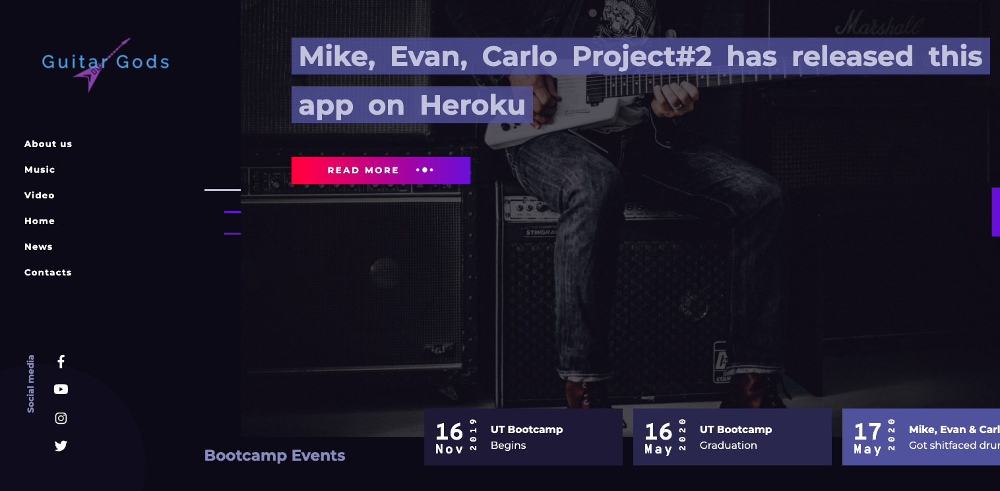

# GuitarGods
Is designed for the admitted guitar geek. See all that is in the Rolling Stones 100 Top Guitarist List.  Search rank, name, genre, band.   Add your own if you think you can give it more justice!

# Heroku
https://ggods.herokuapp.com/

## Getting started
The following section will take you through the steps of setting up this application and getting it running locally on your computer.

If you don't want to set up this project locally and just want to see the deployed application, go to  https://ggods.herokuapp.com/.

### 1. Clone the repository
The first step is to clone the project repository to a local directory on your computer. To clone the repository, run the following commands:
<pre>
  git clone https://github.com/evanmorisato/GuitarGods.git
  cd GuitarGods
</pre>

### 2. Install the Dependencies
Run the following commands in terminal: 
<pre>
  npm install
</pre>  

### 3. Run Application
Run the following command in terminal:
<pre>
  node server.js
</pre>  

**Technologies
---
+ node
+ javascript
+ css
+ handlebars
+ sequelize
+ mysql
+ heroku
+ bootstrap
+ jquery
+ ajax
+ API lastFM
+ Deezer

**Acknowledgements**
---

+ [@mikenezzer](https://github.com/mnezz1131) for being a True Rockstar!
+ [@evanmorisato](https://github.com/evanmorisato) for attention to details. For recognizing a single rock salt in a cup of sugar!
+ [@johncarlo](https://github.com/johncarlobase) for using your Doctorate in Copy and Paste
